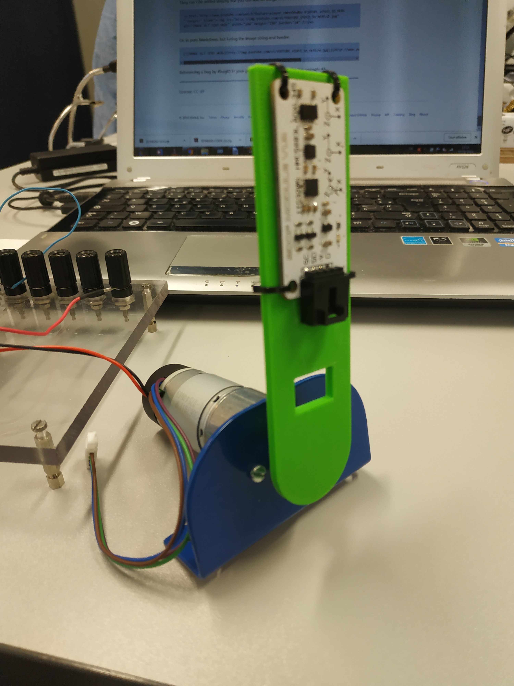

# Octopus 9DOF module assembly

Purpose: This sheet describes how to mount the Octopus 9DOF on the green support, 
and to connect it to the Pololu Driver Shield.

## 1. Preparation / material needed :

This module assembly **MUST** be started after the validation of :
- Motor_assembly_procedure 
- Arduino_motordriver_motor_assembly_procedur 

- Octopus 9DOF module x1                              
- Wire cutter x1
- Male-male wire
- Green support x1
- 2mm screw x1 
- Tie wraps x4

## 2. Operating mode :

- Place the Octopus 9DOF module on the green support

- Use the tie wrap to fasten the two pieces to each other (see picture)

- Cut the exceeding pieces of tie wrap xith the wire cutter.

- Match the green piece to the motor's axis, and screw the 2mm screw into the 
green piece hole, situated on the side of the green piece axis (see pictures).

 

**- With wires :**

- Connect the **G** pin of the **Driver shield** into the **GND** pin of the **Octopus module**; 

- Connect the **V** pin of the **Driver shield** to the **Vin** pin of the **Octopus module**; 

- Connect the **SD** pin of the **Octopus module** into the **SDA** pin of the **Arduino**; 

- Connect additions wires female-female from the **SC** pin of the **Octopus module** to 
male-male wires on the **SCL** pin of the **Arduino**.

- Connect additions wires female-female from the **SD** pin of the **Octopus module** to 
male-male wires on the **SDA** pin of the **Arduino**.

## 3. Criterion of acceptability and refusal :

- The **green piece** has to be correctly fixed into the axis of the motor, 

- The **Octopus module** has to be correctly tighted to the **green piece**; 

- The terminal of the **Octopus module** has to be correctly connected (**G** to **GND**, **V** into **Vin**, **SD** into **SDA** and **SC** into **SCL**)

